```{r echo=FALSE}
knitr::opts_chunk$set(eval = FALSE,out.width = "100%",fig.align = "center") 
```

# 准备工作

## R studio，Git desktop，Github

-   下载[R](https://cloud.r-project.org/bin/)
-   下载[R studio](https://posit.co/products/open-source/rstudio/)
-   下载[Git desktop](https://desktop.github.com/)
-   注册[github](https://github.com/)
-   下载[hugo](https://github.com/gohugoio/hugo/releases)

## 创建仓库和R项目

-   github创建新仓库 

```{r fig.cap='创建github仓库',echo=FALSE,eval=TRUE}
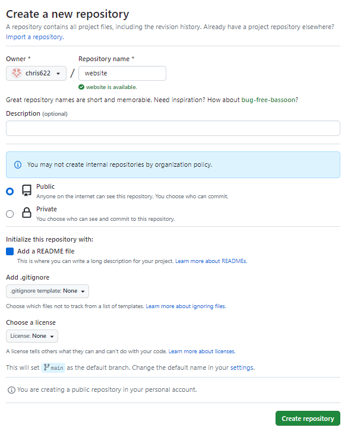
```

-   复制仓库URL

```{r fig.cap='复制仓库URL',echo=FALSE,eval=TRUE}
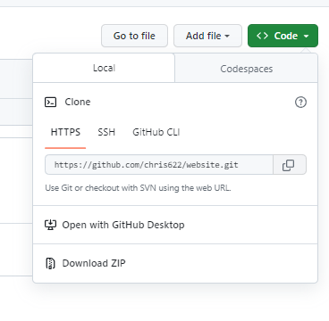
```

-   创建和Github连接的R项目:`R studio-File-New project-Version control-Git`

```{r fig.cap='创建和Github连接的R项目',echo=FALSE,eval=TRUE}
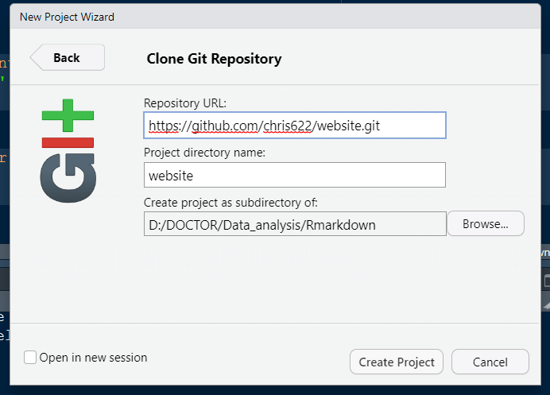
```

# 创建网站

-   在建好的项目中安装`blogdown`包

```{r eval=FALSE}
install.packages('blogdown')
library(blogdown)
```

-   [hugo](https://themes.gohugo.io/)提供了许多模板,选择喜欢的模板，点击`download`跳转到github

```{r fig.cap='模板主题',echo=FALSE,eval=TRUE}
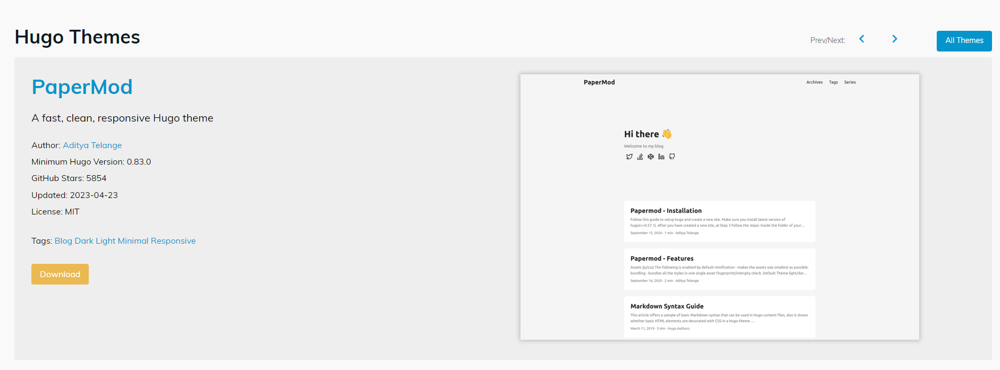
```

-   复制github地址中的`user/hugoname`即为`theme`,如`https://github.com/wowchemy/starter-hugo-academic`对应的theme为`wowchemy/starter-hugo-academic`，使用theme创建网站

```{r}
new_site(theme='wowchemy/starter-hugo-academic')
```

## 预览网站

-   使用`serve_site()`预览网站

```{r }
serve_site()#预览网站
stop_server()#停止预览
```

## 检查与设置

```{r}
check_gitignore()
check_content()
```

-   根据TODO建议，在右下角`Files`查看当前项目路径中的文件，打开`gitignore`,加入

```{gitignore}
.DS_Store
Thumbs.db
/public
/resources
```

# 上传R项目到github

-   打开github desktop， `File-add local repo-选择R项目文件夹-commit-fetch`

```{r fig.cap='上传项目至github',echo=FALSE,eval=TRUE}
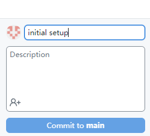
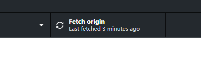
```

-   打开github可以看到项目内容已成功上传

```{r fig.cap='上传项目至github',echo=FALSE,eval=TRUE}
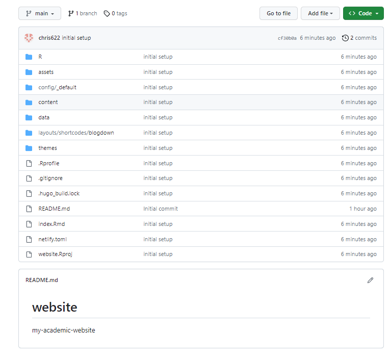
```

# 使用netlify创建网站

-   用github账号登录[netlify](https://app.netlify.com/signup/start)
-   `Add new site-Import an existing project-Github-deploy`

```{r fig.cap='deploy网站',echo=FALSE,eval=TRUE}
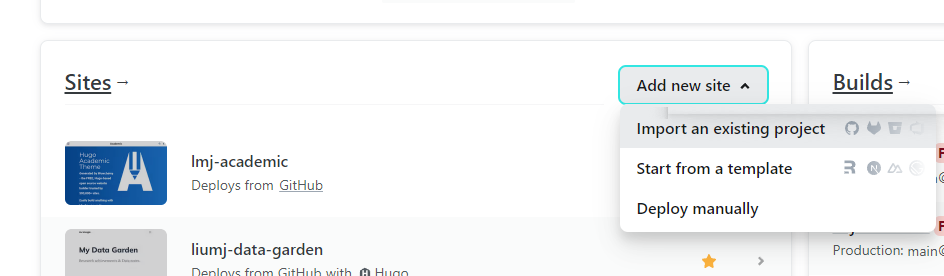
```

-   更改`site settings`,`change site name`可以更改网站名

```{r fig.cap='更改site设置',echo=FALSE,eval=TRUE}
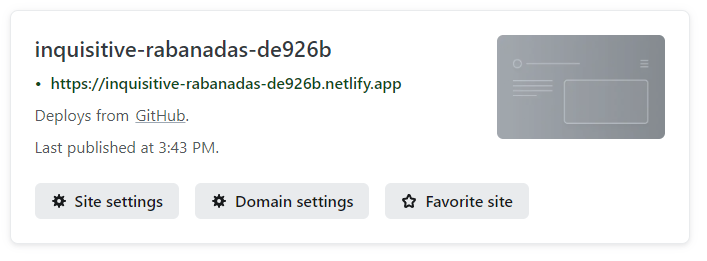
```

-   点击网站名即可跳转到建好的网站

```{r fig.cap='网站建好啦！',echo=FALSE,eval=TRUE}
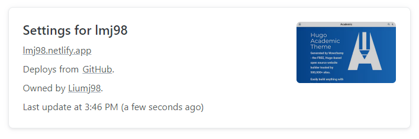
```

-   复制网站名，打开R studio项目文件，找到`config.yaml`，更改`baseURL`为复制好的网站名

```{r fig.cap='最后一步也完成啦！',echo=FALSE,eval=TRUE}
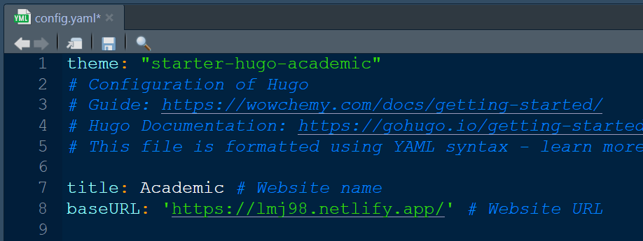
```

# What's next

-   网站基本搭建之后，就可以使用R studio对网站内容进行个性化设置，具体教程可参见：
    -   [blogdown 教程](https://bookdown.org/yihui/blogdown/)
    -   如果使用的是wowchemy的网站模板，可以参见[wowchemy教程](https://wowchemy.com/docs/getting-started/page-builder/)
-   每次修改之后都需要使用github desktop进行更新，具体操作和之前一样，打开`github desktop-commit-fetch`
-   github的更新会自动关联到Netlify的网站更新
