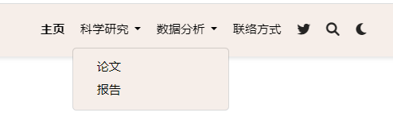

```{r echo=FALSE}
knitr::opts_chunk$set(eval = FALSE,out.width = "70%",fig.align = "center") 
```

# 准备工作
+ 本节内容基于上一节建立的website project，详见[build website](https://rpubs.com/Chris622/build-website)
+ 打开R project，加载`blogdown`包
```{r}
library(blogdown)
serve_site()
```
+ 项目中各个文件的内容可参见[wowchemy](https://wowchemy.com/docs/getting-started/get-started/#remove-any-unused-example-pages)

# 修改config
+ 在项目根目录里找到`config-_default_config.yaml`,双击打开
+ `title`修改网站名`title: Your website name`

# 修改主页内容
+ 在项目根目录里找到`content-_index.md`,双击打开

## 添加section
+ 在`_index.md`文件的`---`内部添加任意多的block,例如，下面是两个纯文本section的例子
```{ }
---
# Page title
title: My page
# Page type - we want a landing page (such as a homepage)
type: landing

# Your landing page sections - add as many different content blocks as you like
sections:
  - block: markdown
    id: section-1
    content:
      title: Section 1
      subtitle: A subtitle
      text: Add any **markdown** formatted content here - text, images, videos, galleries - and even HTML code!
  - block: markdown
    id: section-2
    content:
      title: Section 2
      subtitle: A subtitle
      text: Add your Section 2 content here...
---

```

## 链接section
+ 可以通过编辑`config/_default/menus`从导航栏中链接主页部分。并添加节的id。例如，如果节的id为`section-1`，则在menu的`URL`中将其引用为`"/#section-1"`。
```{r }
#_index.md中的内容
  - block: contact
  content:
    address:
      city: Stanford
      country: United States
      country_code: US
      postcode: "94305"
      region: CA
      street: 450 Serra Mall
    email: test@example.org
    title: Contact
  design:
    columns: "2"
  id: contact #id
#menu中的内容
  - name: 联络方式
    url: '#contact' #对应id
    weight: 30

```

## 删除section
+ 例如首页的Hugo Academic Theme，对应`index.md`中的`block：hero`
```{ }
- block: hero
  content:
    cta:
      label: '**Get Started**'
      url: https://wowchemy.com/templates/
    cta_alt:
      label: Ask a question
      url: https://discord.gg/z8wNYzb
    cta_note:
      label: '<div style="text-shadow: none;"><a class="github-button" href="https://github.com/wowchemy/wowchemy-hugo-themes"
        data-icon="octicon-star" data-size="large" data-show-count="true" aria-label="Star">Star
        Wowchemy Website Builder</a></div><div style="text-shadow: none;"><a class="github-button"
        href="https://github.com/wowchemy/starter-hugo-academic" data-icon="octicon-star"
        data-size="large" data-show-count="true" aria-label="Star">Star the Academic
        template</a></div>'
    image:
      filename: hero-academic.png
    text: |-
      **Generated by Wowchemy - the FREE, Hugo-based open source website builder trusted by 500,000+ sites.**

      **Easily build anything with blocks - no-code required!**

      From landing pages, second brains, and courses to academic resumés, conferences, and tech blogs.

      <!--Custom spacing-->
      <div class="mb-3"></div>
      <!--GitHub Button JS-->
      <script async defer src="https://buttons.github.io/buttons.js"></script>
    title: Hugo Academic Theme
  design:
    background:
      gradient_end: '#1976d2'
      gradient_start: '#004ba0'
      text_color_light: true
```
+ 注意，对block内容进行修改时，可能会影响到导航栏的超链接，需要同步修改`config-_default_menus.yaml`中的内容。例如，如果`Contact`部分的id从`contact`更改为`contact-me`，则可以更新menu.yaml中的`/#contact`url为`/#contact-me`。


## 调整section顺序
+ 在`_index.md`中复制粘贴调整section的顺序

## 自定义section内容
### wowchemy布局
+ [wowchemy](https://wowchemy.com/blocks/)提供了许多布局样式
```{r fig.cap='wowchemy 提供的布局',echo=FALSE,eval=TRUE}
knitr::include_graphics('fig/configure_web/blocks.png')
```
+ 点进去usage有对应的代码，复制加入`_index.md`即可
```{r fig.cap='使用wowchemy 提供的布局',echo=FALSE,eval=TRUE}
knitr::include_graphics('fig/configure_web/use-block.png')
```

### 标题和文字排版
+ 标题`title`，`subtitle`
+ 文本`text`中可以添加任何markdown格式的文本和图像内容。
+ columns设置可以为内容块配置节中的列数。有效的选项有:
  + `1`:一个全宽的列，section内容出现在section标题的正下方(如果设置了的话)
  + `2`:两列，左侧显示章节标题，右侧显示章节内容
```{r}
---
# Page title
title: My page
# Page type - we want a landing page (such as a homepage)
type: landing

# Your landing page sections - add as many different content blocks as you like
sections:
  - block: markdown
    id: section-1
    content:
      title: Section 1
      subtitle: A subtitle
      text: Add any **markdown** formatted content here - text, images, videos, galleries - and even HTML code!
    design:
      # Choose how many columns the section has. Valid values: '1' or '2'.
      columns: '1'
---

```

### 布局样式
+ 设置显示样式`view`，可选的包括
  + List (1)
  + Compact (2)
  + Card (3)
  + Citation (4)
  + Showcase (5)

```{r}
- block: collection
  content:
    filters:
      exclude_featured: true
      folders:
      - publication
    text: |-
      {}
      Quickly discover relevant content by [filtering publications](./publication/).
      {}
    title: Recent Publications
  design:
    columns: "2"
    view: citation#设置展示样式
```

```{r fig.cap='list view',echo=FALSE,eval=TRUE}
knitr::include_graphics('fig/configure_web/list.png')
```

```{r fig.cap='citation view',echo=FALSE,eval=TRUE}
knitr::include_graphics('fig/configure_web/citation.png')
```

```{r}
- block: collection
  content:
    count: 5
    filters:
      author: ""
      category: ""
      exclude_featured: false
      exclude_future: false
      exclude_past: false
      folders:
      - post
      publication_type: ""
      tag: ""
    offset: 0
    order: desc
    subtitle: ""
    text: ""
    title: Recent Posts
  design:
    columns: "2"
    view: compact #设置展示样式
  id: posts
```

```{r fig.cap='compact view',echo=FALSE,eval=TRUE}
knitr::include_graphics('fig/configure_web/compact.png')
```

```{r fig.cap='showcase view',echo=FALSE,eval=TRUE}
knitr::include_graphics('fig/configure_web/showcase.png')
```

```{r fig.cap='card view',echo=FALSE,eval=TRUE}
knitr::include_graphics('fig/configure_web/card.png')
```

### 图标
+ 可以使用来自[font awesome](https://fontawesome.com/icons?d=gallery)和[academicons](https://jpswalsh.github.io/academicons/)的图标
+ 在`config-default-params.yaml`中设置允许图标
```{r}
extensions:
  academicons:
    enable: true
```
+ 使用fab pack图标，[查看所有图标](https://fontawesome.com/icons?d=gallery&s=brands)
```{r}
- block: features
  content:
    items:
    - description: 90%
      icon: r-project #链接中的图标名
      icon_pack: fab #选择图标pack
      name: R #显示的图标名称
```
+ 使用fas pack图标，[查看所有图标](https://jpswalsh.github.io/academicons/)
```{r}
- block: features
  content:
    items:
    - description: 100%
      icon: chart-line #链接中的图标名
      icon_pack: fas #选择图标pack
      name: Statistics #显示的图标名称
```
+ 使用自定义的图标([可以用这个网站自定义](https://www.flaticon.com/)),将SVG格式的图标保存至`assets/media/icons/`，直接按名字调用（不需要后缀.svg）即可

### 背景颜色
+ 在`design:background`里设置block背景
+ 纯色背景，可选颜色包括[html color name](https://html-color-codes.info/color-names/)和[html color code](https://html-color-codes.info/)
```{r}
design:
  background:
    # Choose a color such as from https://html-color-codes.info
    color: 'navy'
    # Text color (true=light, false=dark, or remove for the dynamic theme color). 
    text_color_light: true
```
+ 渐变背景
```{r}
design:
  background:
    # Choose colors such as from https://html-color-codes.info
    gradient_start: '#4bb4e3'
    gradient_end: '#2b94c3'
    # The gradient angle from 0-360 degrees
    gradient_angle: 180
    # Text color (true=light, false=dark, or remove for the dynamic theme color).
    text_color_light: true
```
+ 图片背景
```{r}
design:
  background:
    image:
      # Name of image in `assets/media/`.
      filename: background.jpg
      # Apply image filters?
      filters:
        # Darken the image? Range 0-1 where 1 is transparent and 0 is opaque.
        brightness: 0.6
      #  Image fit. Options are `cover` (default), `contain`, or `actual` size.
      size: cover
      # Image focal point. Options include `left`, `center` (default), or `right`.
      position: center
      # Use a fun parallax-like fixed background effect on desktop? true/false
      parallax: true
      # Text color (true=light, false=dark, or remove for the dynamic theme color).
      text_color_light: true
```
+ 视频背景
```{r}
design:
  background:
    video:
      # Name of video in `assets/media/`.
      filename: background-video.mp4
      # Post-processing: flip the video horizontally?
      flip: false
```

### 间隔
+ 可以通过指定部分的顶部、右侧、底部和左侧的填充来控制block之间的间距
```{r}
design:
  spacing:
    # Customize the section spacing. Order is top, right, bottom, left.
    padding: ["20px", "0", "20px", "0"]
```

### css样式
+ 可以使用CSS自定义小部件的特定实例的样式。例如，可以更改部分的字体大小。
+ 要将新样式应用到小部件上，请在小部件的前面设置css_class。例如css_class: "MY_CSS_CLASS"，其中MY_CSS_CLASS是您在上一步中定义的CSS类的名称。可以添加多个类，用空格分隔。
```{r}
design:
  css_style: ''
  css_class: ''
```

# 修改样式
+ 在项目根目录里找到`config-_default_params.yaml`,双击打开

## 修改外观
+ `appearance`设置外观
```{r}
appearance:
  theme_day: Earth
  theme_night: Coffee
  font: minimal
  font_size: L
```
+ theme样式可参见[color themes](https://wowchemy.com/docs/getting-started/customization/#color-themes),可设置明亮和黑暗两种模型，具体包括：
```{r echo=FALSE,eval=TRUE}
knitr::include_graphics('fig/configure_web/theme.png')
```

+ font字体样式可参见[fonts](https://wowchemy.com/docs/getting-started/customization/#fonts),可以设置大小，包括：
```{r echo=FALSE,eval=TRUE}
knitr::include_graphics('fig/configure_web/font.png')
```

+ 也可以自定义主题格式,参见[Custom theme](https://wowchemy.com/docs/getting-started/customization/#custom-theme)

## 修改导航栏
+ `site header`设置导航栏样式
```{r}
# Site header

header:
  navbar:
#设置是否展示navbar
    enable: true
#navbar 位置 l左 c中 r右
    align: l
#在导航栏中显示您的网站标题或“content/media/logo*”图像?
    show_logo: true
#显示语言选择器(如果您已经翻译了您的网站内容)?
    show_language: false
#让用户选择默认亮/暗模式?
    show_day_night: true
#让用户从导航栏搜索?
    show_search: true
#尝试自动突出显示活动菜单链接?对于复杂的站点可以禁用。
    highlight_active_link: true
```

+ 在项目根目录里找到`config-_default_menus.yaml`,双击打开修改导航栏内容
+ 可以更改导航栏上的名称`name`，链接`URL`和顺序`weight`，例如把导航栏全换成中文
```{r}
main:
  - name: 主页
    url: '#about'
    weight: 10
  - name: 帖子
    url: '#posts'
    weight: 20
  - name: 项目
    url: '#projects'
    weight: 30
  - name: 报告
    url: '#talks'
    weight: 40
  - name: 文献
    url: '#featured'
    weight: 50
  - name: 联络方式
    url: '#contact'
    weight: 60
```
+ `url`对应的是`根目录-content-index.md中id`的内容，当修改id时也要在`menu.yaml`中修改超链接的对应
+ `weight`大小指示排列顺序
+ 用`identifier`和`parent:`设置子目录
```{r}
  - name: 科学研究
    identifier: research #母目录设置identifier标识
    weight: 20
  - name: 论文
    parent: research #在子目录里设置parent设置对应母目录
    url: '#featured'
    weight: 1
  - name: 报告
    parent: research
    url: '#talks'
    weight: 2
    
  - name: 数据分析
    identifier: data
    weight: 30
  - name: 项目
    parent: data
    url: '#projects'
    weight: 1
  - name: 教程
    parent: data
    url: '#posts'
    weight: 2

```

```{r echo=FALSE,eval=TRUE}

```

+ 更多关于hugo menu设置请参见[hugo menu](https://gohugo.io/content-management/menus/)

## 设置时间日期格式
+ `locale`修改格式，可选的格式参见[Date/time options](https://wowchemy.com/docs/getting-started/customization/#datetime-options)
```{r}
# Localization

locale:
  date_format: 'Jan-2-2006'
  time_format: '3:04 PM'
  address_format: en-us
```


